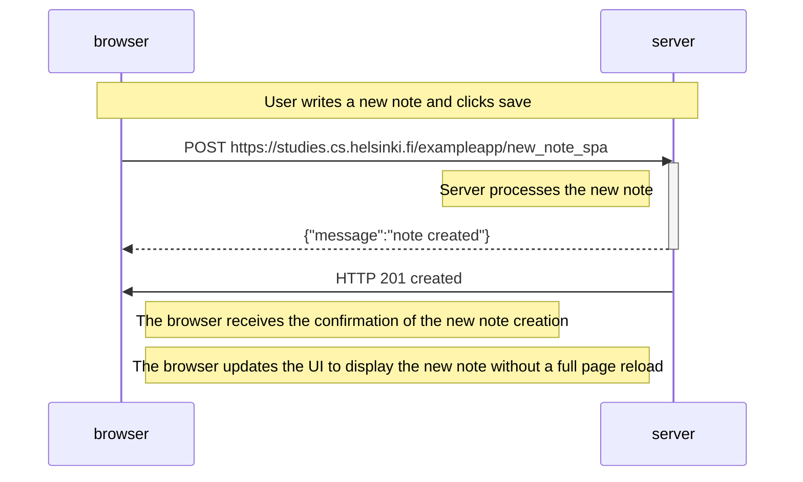

```mermaid
sequenceDiagram
    participant browser
    participant server

    Note over browser,server: User writes a new note and clicks save

    browser->>server: POST https://studies.cs.helsinki.fi/exampleapp/new_note_spa
    activate server
    Note left of server: Server processes the new note
    server-->>browser: {"message":"note created"}
    deactivate server
    
    server->>browser: HTTP 201 created
    

    Note right of browser: The browser receives the confirmation of the new note creation

    Note right of browser: The browser updates the UI to display the new note without a full page reload
```
